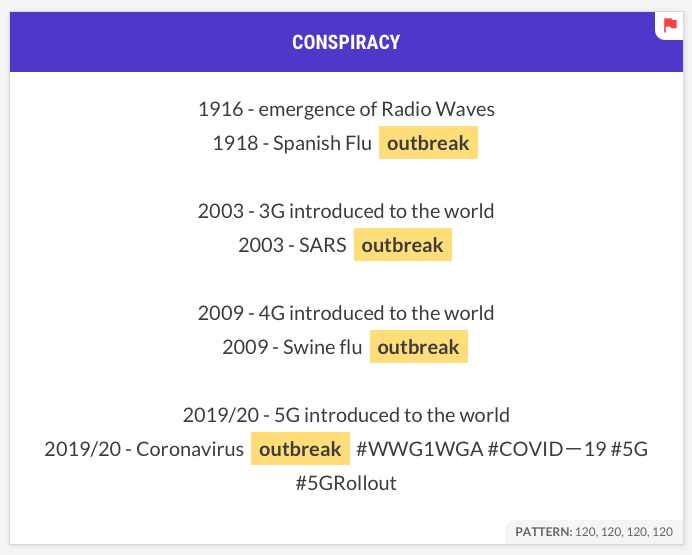
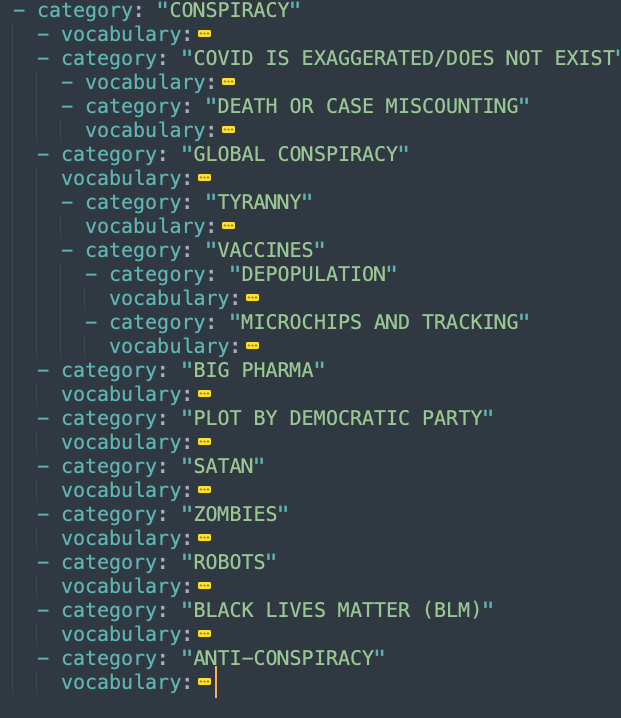

# Covid Rumours in Historical Context

[Covid Rumours in Historical Context](https://historyandrumour.blogs.sas.ac.uk), funded by UKRI's Arts and Humanities Research Council (AHRC Grant Ref: AH/V012762/1).

This project examined the pandemic of rumour and of disinformation that has accompanied the COVID-19 outbreak in the UK. It took a historical perspective, analysing how and why similar rumours have spread in the past, how previous governments have responded to them, and evaluating how successful these efforts were. The study tracked the language of rumours (via international English language Twitter data) relating to the COVID-19 pandemic and vaccination programme, and compared them to historical precedents.

**Project team**

Professor Jo Fox (PI, School of Advanced Study, University of London), Dr David Coast (Co-I, Bath Spa University), Professor James Smith (Co-I, Durham University), Martin Steer (Co-I, Digital Humanitites Research Hub, School of Advanced Study, University of London), Kunika Kono (Digital Humanitites Research Hub, School of Advanced Study), Jacob Forward (History & Policy, Insititute of Historical Research), Richard Williams (ITDS, University of London).

Thankyou to Sam Sakabuth (Wordpress setup and management) and Gemma Dormer (Events coordination and planning) for their help and support throughout the project.

**Publications**

Fox, Jo, David Coast, and Jacob Forward, "[Covid Rumours in Historical Context - Two Policymaking Paradigms](https://www.historyandpolicy.org/policy-papers/papers/covid-rumours-in-historical-context-two-policymaking-paradigms)", *History & Policy*, 2022

Forward, Jacob, Jo Fox, David Coast, James Smith, and Martin Steer, "[Data Workshop Report](https://historyandrumour.blogs.sas.ac.uk/data-workshop-report)", *History & Policy*, 2021

Fox, Jo, David Coast, James Smith, and Martin Steer, "[COVID-19 rumours in historical context](https://pandemicandbeyond.exeter.ac.uk/wp-content/uploads/2022/03/Rumours_Fox_PolicyBrief_Nov21.pdf)", *The Pandemic and Beyond*, 2021

<br />

## Project repositories

The project's digital outputs have been published in three repositories:
1. covid-rumours  (this repository): Used for the data analysis, taxonomy and classifier modelling.
1. [covid-rumours-data](https://github.com/SAS-DHRH/covid-rumours-data): Derivative data from the tweet corpus.
1. [covid-rumours-dashboard](https://github.com/SAS-DHRH/covid-rumours-dashboard): The dashboard for exploring diachronic semantic fields in the data.

For more information about each of these repositories, please see their respective README files.

This collection of 3 repositories link together the digital outputs of this project, including source code (working and not-working), raw data references, derivative and anonymous datasets, visualisation and data exploration dashboard, annotated tweet data, classifier pipelines, taxonomies of rumour and technical and methodological documentation.


<br />

## About the project



*Conspiratorial tweet from the covid-rumours-data corpus obfuscating causation and correlation of historical events.*

The Covid-19 outbreak has been accompanied by a global pandemic of rumour and disinformation. Rumours about the origins of the virus, shortages, fake cures and government conspiracies are being spread both by well-meaning people who want to make sense of the outbreak, as well as by criminals and hostile foreign governments actively seeking to do harm. These rumours have the potential to cost lives, not least by undermining public confidence in the pandemic response vaccination programmes. Despite the apparent novelty of ‘fake news’ and its online circulation via social media platforms, there is little that is new about these rumours, all of which have their historical precedents. Yet policymakers know little about how and why similar rumours have spread in the past, how previous governments have responded to them, and how successful these efforts were.

At a point in history in which rumours about Covid-19 present an unprecedented challenge to public health, global democracy and the neoliberal captalistic empire, this project will deploy a novel longitudinal study of relevant historical rumours and government efforts to address them. It will track rumours circulating in the UK, in order to assist policymakers in relating to the Covid-19 pandemic and the vaccination programme and compare these situation to historical precedents. A report, published in collaboration with [History & Policy](https://www.historyandpolicy.org/), as well as two closed workshops with policy-makers and scholars drawn from other disciplines, will seek to inform UK government strategies for dealing with mis- and disinformation and influence the tone and content of public information campaigns, in order to minimise the harmful impact of ‘fake news’ and maximise uptake of the vaccine and other public health measures.

### Seminar presentation

The project was presented and discussed at several research seminars, during the first quarter of 2022. A PDF of the data and methods presentation is available in this repository here: [notes/Data and methods for Covid-19 Rumours in Historical Context-DHRH Seminar-2022-03-21-MS](notes/Data and methods for Covid-19 Rumours in Historical Context-DHRH Seminar-2022-03-21-MS).

### Version control and sensitive data

Due to privacy and distribution reasons (lotsa large data) the original twitter data and most of the built data is not directly contained within this git repository. It is version controlled and stored separately in a private secure data enclave. The `*.dvc` text files represent files managed in this manner.

For example, the files in the `./build` directory are generated from the original Tweet JSONL data using the `Makefile`. The Makefile contains the commands to do the data processing but much of this built data still contains usernames or other senstitive information and is stored outside of git in [Data Version Control](https://dvc.org/).

### Data management

Please see the README.md file in the [covid-rumours-data](https://github.com/SAS-DHRH/covid-rumours-data) repository for additional documentation and information about the tweet harvesting, data collection and storage.

Below is an outline of the directories in this repository and their usages. When you clone this repository there might be some directories missing, so look at your own filesystem and then back at this to understand the data architecture and it's different pubilc/private access contexts:

```
│
├── build        <- classified data, as spacy docbin collections and tweet text zip files
├── dashboard    <- git submodule linking the covid-rumours-dashboard repository
│                    into this main project repository
├── data         <- working data, including data imported via Data Version Control (dvc)
│   ├── ambiguity-data      <- ambiguity data dictionaries (git submodule)
│   ├── annotations         <- annotation data created by the project team
│   └── covid-rumours-data  <- data imported from covid-rumours-data/build (using dvc)
├── Makefile     <- The gnu makefile which was used to perform much of the data processing
├── models       <- Spacy classifier models
│   └── Makefile <- Makefile for model training
├── ngrok.yml    <- Proxy service config (to host Prodi.gy and Streamlit through firewall)
├── notes        <- methodological documentation, original git history (and old scripts)
├── README.md    <- This file
├── scripts      <- custom scripts and notebooks used for data analysis and processing
└── taxonomies   <- YAML versions of the 4 taxonomies produced by the project team
```

### Data pipeline

The data pipeline is itself a model of the transformations and interventions to the data as it gets refined from raw to visual information. This sequence of verbs convey quantatitive actions. The order of which appears completely linear, but the design and implementation of this sequence was iterative where each step was designed somewhat independently then plugged in, modified and somehow made to work with the others.

1. Harvesting - twarc twitter harvested using a raspberry pi
2. Cleaning - removing corrupted tweets, zipping and consistently naming daily data files
3. Preprocessing - using jq on the command line to extract the fields of interest from tweet structure
4. Sampling - randomly sample tweets to produce sub-datasets for two purposes, 1) investigation of the vocabularies used in the tweet corpus and 2) categorical annotation by the research team
5. Annotating - used prod.gy to annotate data samples
6. Classifying - used the annotated data to train multiple classifiers, then classified and partitioned the corpus
7. Postprocessing - extracted n-grams from the corpus, and calculated mutual information scores for each of the data partitions 
8. Visualising - presented the data in a web dashboard, experimented with diachronic UI/UX of the data structures
9. Exploring - used the web dashboard to explore, compare and contrast the data in the corpus
10. Interpreting - use historical sources and table of contemporary events to contexualise and interpret the twitter data

### Method

The ad-hoc and exploratory approach to conducting this research makes it difficult to communicate the method in a sequential way. A lot of investigations, false starts, problematic software and alternative computational techniques were explored, and deemed unfit or too difficult to incorporate. We tried to keep track of these attempts as best we could, and these are documented in [notes/data analyses and methods.md](notes/data analyses and methods.md). We hope that this and that document contain some of the outside thinking, decision making and design processes we explored and experimented with.

However, in more general terms the final method used for the project can be described as follows: We collected tweets, used those tweets to inform a vocabulary coding exercise, from which we produced several strict taxonomies of covid misinformation. These taxonomies were then used to bootstrap annotations across the huge corpus of data and those annotations were then used to train several machine learning classifiers. We then used the classifiers to partition the corpus into 4 separate categories of misinformation. Linguistic processing was then performed across the whole corpus AND on each of the partitions, each generating a timeseries dataset of bi-gram co-occurrence frequencies and their equivalent Pointwise Mutual Information (PMI) likeyhood scores. The dashboard was then built to use these timeseries datasets, and crucially combine them with a contemporary event timeline, which allowed our research team to explore, query, contrast and compare the semantics of covid misinformation used within the tweets, and to contextualise all of this within the political and social events that occurred during the pandemic. Explorations and interpretations were additionally informed by a expert selection of relevant historical sources and events, found through historical archival resaearch.

The computational signal processesing we eventually used to visualise and discover semantic field patterns in our corpus was Pointwise Mutual Information. The graph visualisation of the *informational likelihood* between words (as a proxy for concepts) was the result. Further semantic relationships were also modelled through the use of diachronic timeseries, each aligned with the classified partitions of the dataset. We think this is a novel approach which turned traditional machine learning back on itself in an attempt to apply, leverage and interpret the classifier's semantics (not interrogate the model itself, which is a common approach for Explainable AI (XAI)). The resulting graph visualisation also reminds us of how some of the the more computationally intensive (popular, cool, trendy, SOTA) Transformer models which are used in Natural Language Processing today (GPT, BERT, etc.) might "look from the inside out".

### Taxonomies



*Screenshot of CONSPIRACY taxonomy YAML file, with vocabulary sections collapsed*

Four Taxonomies of Rumour were produced from both historical sources and close reading of a sample of the corpus. They are CONSPIRACY, CURES, ORIGINS and VACCINES. The taxonomies are included as structured YAML files and reusable by others, and are available in this repository in the `taxonomies` directory, and also in the covid-rumours-dashboard `data` directory, where they are used to facet the n-grams and initiate conceptual and diachronic exploration of the langauage semantics of the corpus.

Each taxonomy includes a set of subcategories and vocabularies. The taxonomies were used to classify the English tweets for the project’s linguistic analyses and used to explore the diachronic and categorical semantics within the social media data using the dashboard.

### Prototype dashboard


*Screenshot of the prototype semantic field explorer dashboard, showing word frequencies with additional word collocation semantic associations*

The [dashboard](https://github.com/SAS-DHRH/covid-rumours-dashboard) was built as a tool to process and explore the linguistic semantic fields within the corpus of Twitter data collected between April 2020 and January 2022. It implemented diachronic linguistic methods and allowed fine-grained conceptual associations used by the online communities to be better observed, contrasted and compared (between different rumour categories) and subsequently understood in the context of relevant historical precedents.

### Software dependencies


*Screenshot of Data Version Control transferring hash encoded data files from the Secure Enclave called 'marjory'*

Because we are providing the code, notes and data as-is, and because it was written for quite a specific project, it is unlikley to be a fully working thing striaght out of the box. However, we hope there is a lot of code snippets, data processing research notes and data management techniques to be learnt from reading our code (and our mistakes).

Rather than listing all the 'requirements' we are providing a list of all the software utilities the project utilised and experimented with, as well as short descriptions of how and why they were chosen. This may make the whole project seem complicated, but we prefer to think of this list as a more transparent list of how we took every-day single-use computational tools, and brought a plurality of them together into a Digital Humanities data analysis research project.

- [GNU make](https://www.gnu.org/software/make/) for controlling the data generation, parallel processing and extraction of files, documenting the command line commands used to connect the scripts, tools, libraries and other software together into data pipelines. You can try to run the `Makefile` yourself, but these are most useful as a record of the commands used throughout the project.
- [gzcat](https://docs.oracle.com/cd/E86824_01/html/E54763/gzcat-1.html) to extract and [pigz](http://www.zlib.net/pigz/) to compress file contents into and out of zipped files on the fly and in parrallel, reducing the storage and processing time requirements significantly.
- cat, cut, sort, awk, grep and uniq command line utilites to work with the plain text data in the `Makefiles`.
- [Csvkit](https://csvkit.readthedocs.io/en/latest/) used for working with data and reports as tabular CSV format.
- [Git](https://git-scm.com) to version control the code and documentation.
- [DVC](https://dvc.org) to version control the data and store it privately in a Secure Enclave.
- [Twarc](https://github.com/medialab/minet) used to harvest tweets as JSON from the Twitter API.
- [jq](https://stedolan.github.io/jq/
  ) used for processing of JSON files on the command line.
- [Spacy](https://spacy.io) used for NLP tasks such as tokenisation and text classification.
- [Prodigy](https://prodi.gy) is a licensed tool, and used for broadening taxonomy vocabularies, annotating twitter data, reviewing annotation labels and training the classifiers.
- [STTM: A Library of Short Text Topic Modeling](https://github.com/qiang2100/STTM) used for experimenting with topic modelling and distant reading (but was not formally inforporated into the data analysis or dashboards).
- [Minet](https://github.com/medialab/minet) used for downloading sample media/images and for harvesting [tweet attrition](https://github.com/medialab/minet/blob/master/docs/cli.md#attrition) datasets. (Thanks to the team at *Sciences Po's [médialab](https://medialab.sciencespo.fr/) in Paris*, for their timely implementation of the [twitter attrition function in the minet tool](https://github.com/medialab/minet/blob/master/docs/cli.md#attrition))
- [Anaconda/Jupyter lab](http://anaconda.com/products/individual) used to write pyhton scripts and explore the data management and processing algorithms.
- [NGrok](https://ngrok.com) is a paid service, and was used as a proxy to allow password protected development tools and web dashboards through the company firewall.
- [TQDM](https://tqdm.github.io) for progress bars, which really helps monitoring the state of long running data processing (it's very useful to know the progress of builds which take many hours to tell if they have crashed or suspended or broken or dedded).
- Python 3.x
  - [Streamlit](https://git-scm.com) to build and host interactive dashboards and visualisations for exploring and analysis the corpus
  - [Pandas](https://pandas.pydata.org) and [Numpy](https://numpy.org) for csv and data frame processing, resampling and plotting
  - [NLTK](https://www.nltk.org) for some ngram processing
  - [Networkx](https://networkx.org) for network graph visualisation of linguistic colocations
  - [Altair](https://altair-viz.github.io) and [VegaLite](https://vega.github.io) for describing interactive visualisations, plots and charts
  - [Shifterator](https://shifterator.readthedocs.io) was not used, but helped us investigate what kinds of diachronic and comparitave data analyses we could achieve using ngrams.

<br />

## Bibliography

Guntuku S, Purtle J, Meisel Z, Merchant R, Agarwal. A Partisan Differences in Twitter Language Among US Legislators During the COVID-19 Pandemic: Cross-sectional Study. J Med Internet Res 2021;23(6):e27300. URL: https://www.jmir.org/2021/6/e27300 DOI: 10.2196/27300

Sharath Chandra Guntuku, Alison M. Buttenheim, Garrick Sherman, Raina M. Merchant,
Twitter discourse reveals geographical and temporal variation in concerns about COVID-19 vaccines in the United States, Vaccine, Volume 39, Issue 30, 2021, Pages 4034-4038, ISSN 0264-410X, https://doi.org/10.1016/j.vaccine.2021.06.014. (https://www.sciencedirect.com/science/article/pii/S0264410X21007386)

David Mimno. 2012. Computational historiography: Data mining in a century of classics journals. <i>J. Comput. Cult. Herit.</i> 5, 1, Article 3 (April 2012), 19 pages. DOI: https://doi.org/10.1145/2160165.2160168, http://www.perseus.tufts.edu/publications/02-jocch-mimno.pdf

Li, Chenliang, Yu Duan, Haoran Wang, Zhiqian Zhang, Aixin Sun, and Zongyang ma. ‘Enhancing Topic Modeling for Short Texts with Auxiliary Word Embeddings’. *ACM Transactions on Information Systems* 36 (21 August 2017): 1–30. https://doi.org/10.1145/3091108.

Qiang, Jipeng, Yun Li, Yunhao Yuan, Wei Liu, and Xindong Wu. ‘STTM: A Tool for Short Text Topic Modeling’. *ArXiv:1808.02215 [Cs]*, 7 August 2018. http://arxiv.org/abs/1808.02215.

Qiang, Jipeng, Ping Chen, Tong Wang, and Xindong Wu. ‘Topic Modeling over Short Texts by Incorporating Word Embeddings’. *ArXiv:1609.08496 [Cs]*, 27 September 2016. http://arxiv.org/abs/1609.08496.

Heyer, Gerhard, Cathleen Kantner, Andreas Niekler, Max Overbeck, and Gregor Wiedemann. ‘Modeling the Dynamics of Domain Specific Terminology in Diachronic Corpora’, 2017. https://doi.org/10.48550/ARXIV.1707.03255.

Gallagher, Ryan. J., Morgan R. Frank, Lewis Mitchell, Aaron J. Schwartz, Andrew J. Reagan, Christopher M. Danforth, and Peter Sheridan Dodds. “Generalized Word Shift Graphs: A Method for Visualizing and Explaining Pairwise Comparisons Between Texts.”” *EPJ Data Science* 10, no. 4 (2021).

Robert Hogenraad, Emeritus Professor (August 2017). [Smoke and mirrors: Tracing ambiguity in texts](https://www.researchgate.net/publication/319136617_Smoke_and_mirrors_Tracing_ambiguity_in_texts) [Accessed 6 July 2021].

Ambiguity and Vagueness dictionaries https://github.com/SAS-DHRH/ambiguity-data

Tsakalidis, Adam, Bazzi, Marya, Cucuringu, Mihai, Basile, Pierpaolo, & McGillivray, Barbara. (2019). Mining the UK Web Archive for Semantic Change Detection (Dataset) [Data set]. Zenodo. https://doi.org/10.5281/zenodo.3383660

Spacy 2 and 3 models of the above dataset: https://github.com/martysteer/Semantic_Change

Jeffrey Pennington, Richard Socher, and Christopher Manning. 2014. [GloVe: Global Vectors for Word Representation](https://aclanthology.org/D14-1162). In *Proceedings of the 2014 Conference on Empirical Methods in Natural Language Processing (EMNLP)*, pages 1532–1543, Doha, Qatar. Association for Computational Linguistics.

Glove twitter word vectors https://nlp.stanford.edu/projects/glove/

Dunning, Ted. ‘Accurate Methods for the Statistics of Surprise and Coincidence’. *COMPUTATIONAL LINGUISTICS* 19, no. 1 (1993): 61–74.

Heyer, Gerhard, Cathleen Kantner, Andreas Niekler, and Max Overbeck. ‘Modeling the Dynamics of Domain Specific Terminology in Diachronic Corpora’, n.d., 16.

<br />

## Citation

Please cite this project as follows:

```
Covid Rumours in Historical Context, Data analysis of COVID-19 tweets, Digital Humanities Research Hub, School of Advanced Study, University of London. url: https://github.com/SAS-DHRH/covid-rumours [accessed: YYYY-MM-DD]
```

<br />

## License

Unless otherwise stated, the data and code produced by the project are released under [Creative Commons CC0 1.0 Universal](https://creativecommons.org/publicdomain/zero/1.0/) license and in accordance with the [University of London’s research policies](https://www.sas.ac.uk/discover-our-research/research-governance-policies).

All Twitter data provided in the project's repositories is subject to Twitter's [Terms of Service](https://twitter.com/en/tos), [Privacy Policy](https://twitter.com/en/privacy), [Developer Agreement](https://developer.twitter.com/en/developer-terms/agreement), and [Developer Policy](https://developer.twitter.com/en/developer-terms/policy). Tweet IDs, where included, are shared for the sole purpose of non-commercial research, as stipulated by Twitter's [terms of content redistribution](https://developer.twitter.com/en/developer-terms/policy).

<br />

## Disclaimer

All the data and code in this project's repositories are provided as-is.

<br />

\---

Martin Steer and Kunika Kono, [Digital Humanities Research Hub (DHRH)](https://www.sas.ac.uk/digital-humanities), School of Advanced Study (SAS), University of London.  

:octocat: Find us on GitHub at https://github.com/SAS-DHRH
