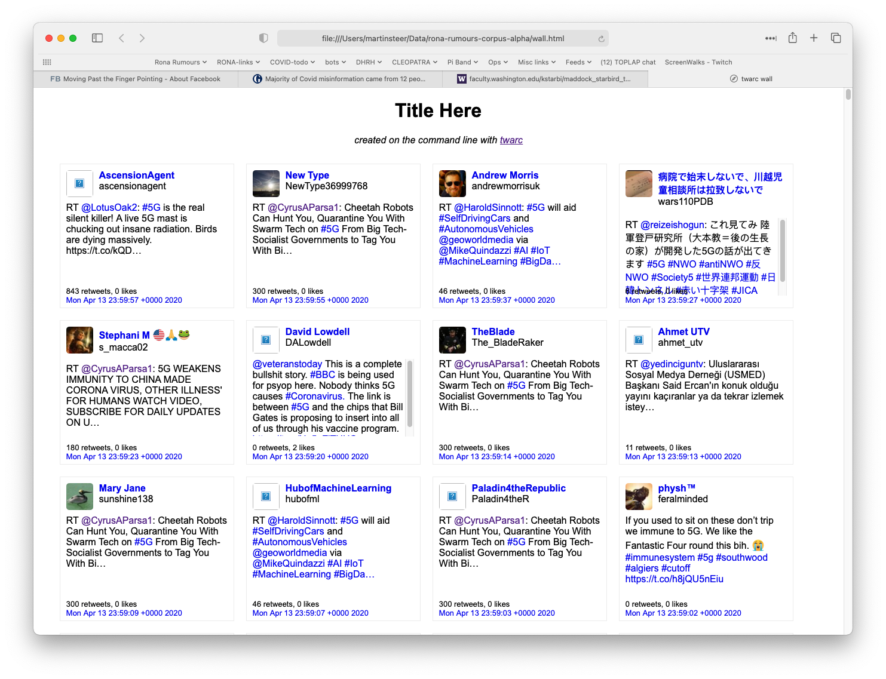
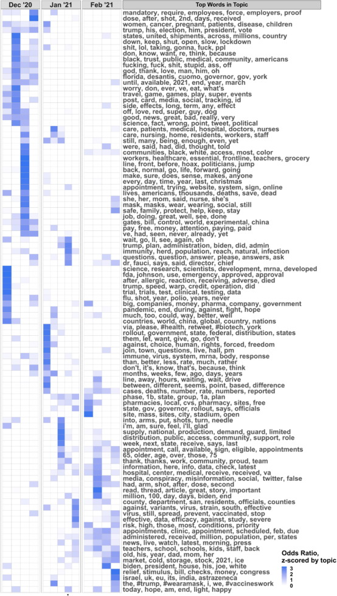
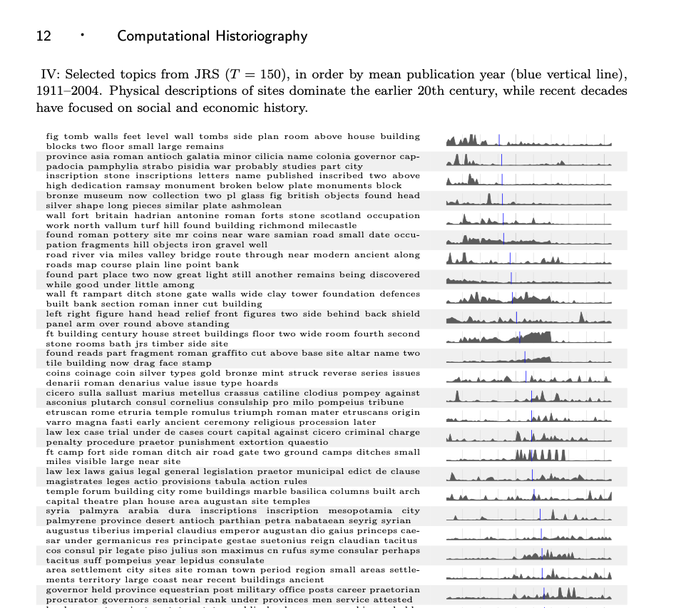
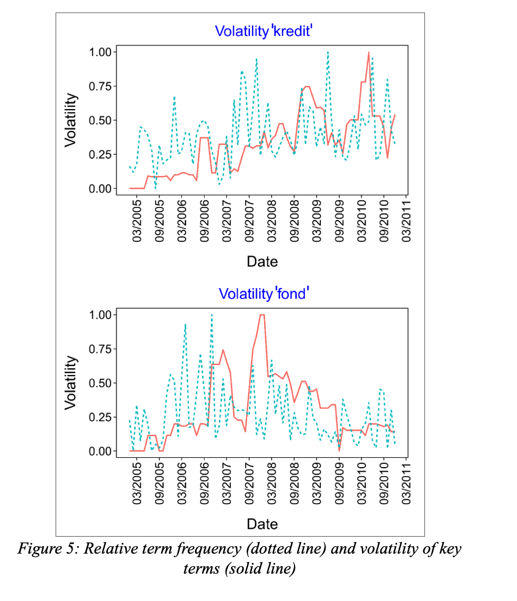
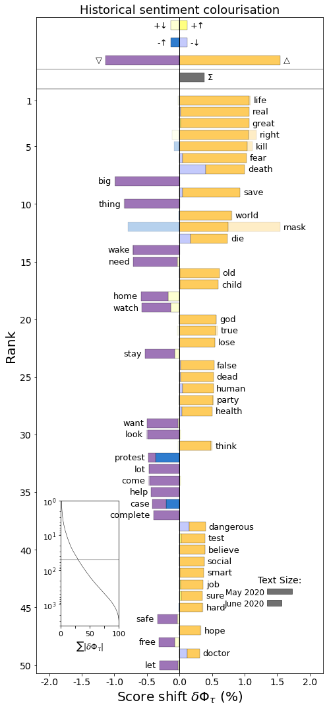
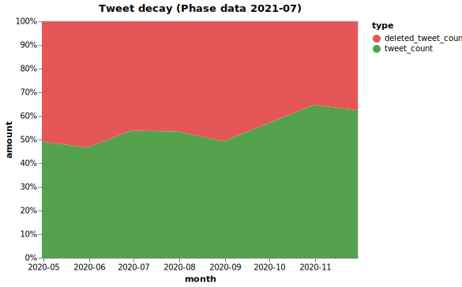

# Covid Rumours in Historical Context

## Data analyses and technical methods

*School of Advanced Study, University of London, 2020-2022*

**Project website:** https://historyandrumour.blogs.sas.ac.uk

### Prioritising data analytic efforts

The first 6 months of the project were very much about getting to grips with managing the daily data collection and authoring the architecture for reproducible data processing with a `Makefile`. Data was streaming in each day and so the analyses we decided to perform needed to be able to be re-run across the corpus, either in totality or incrementally.

A literature review was also conducted during this time to identity a wide range of different data analyses we could perform upon our data. Many of these are listed below. The papers or articles we identified as utilising each method are in the Bibliography in the main readme.md file. The list of potential analyses was discussed at several of the project meetings, in order to determine what each report could achieve and if this was of relevance to the project. A prioritisation of which data analyses were thought to be the most useful to experiment with was agreed. This didn't mean that any of the analyses were to be finalised, but topic modelling was one of the early analyses attempted.

### Things in the data which are of interest

After the topic models were initially produced and shared with the project team, we met to discuss what the topics and hashtags told us about what we might want to explore further. The list below represent the early ideas which were of interest to the team.

- State actors vs random users: language used on both sides, language that evades censorship, bot accounts
- Global conspiracies/surveillance: Medical conspiracies, Scams, hoaxes and fakes, QAnon
- Disease does not exist or is exaggerated: Disease fear/anxiety
- General: Big tech, Robots, Rise of China, Depopulation, Cures
- Linguistics: Neologisms, Portmanteau, Opaque/vague, Rhetoric
- Publics and Counterpublics

We then began to prioritise and research how we might pursue mining and discovering more about each of these things using computational methods. Some of these items require keyword searching and filtering of the data for closer investigation, and others required classification and semantic language modelling to detect.

### High priority analyses

#### Word (unigram, bigram), user, URL, tweet, hashtag frequencies 

**Used for:** feature engineering, reporting, corpus triaging

Frequencies were generated using a combination of command line utilities, and are documented in the `Makefiles`.

#### Tweet walls

**Used for:** Displaing subset of tweets for communication/demonstration purposes. Need to be a bit careful as the twarc script currently displays usernames/account pictures.
**Data management:** Must share and view entirely on OneDrive for data protection.
**Requires:** [Twarc](https://github.com/DocNow/twarc), python, web browser.

The data was collected in Twitter's native format, JSON Lines (.jsonl). This makes viewing the actual tweet text fairly difficult, and requires anyone viewing the data to have a copy of all the metadata fields, many of which are not relevant when one simply wants to see the tweet text to get a sense of what the people are talking about.



*Example HTML tweet wall, used to view samples of tweets from a tweet corpus*

The [twarc](https://github.com/DocNow/twarc) harvesting utility contains a separate script for making *tweet walls*. This script converts the raw JSONL into a HTML file, which can then be viewed in a web browser. The original script can put any number of tweets into a single HTML file and includes a URL to each account's avatar image. This meant that we could not convert the entire corpus, or even a single daily file because the HTML page generated was so large and the browser would have to download each individual avatar image from twitter's servers. This made it impossible to use to directly convert each daily file to a viewable file format, so we developed a mechanism to extract a sample of tweets (based on topics and keywords of interest) from the daily files and modifed the original script to avoid downloading all the avatar images.

Example code used to extract CONSPIRACY samples and convert them to twarc walls:

```bash
# We unzip all daily files in April 2020 (2020-04-*) and pipe this data into
# the Spacy-match.py script. This script takes a Spacy patterns.jsonl file and
# an exclude patterns file (for words which are incredibly dominant, such as '5g')
# and outputs just the tweets which have tweet text that matches any of the patterns.

gzcat ./build/noscruff/rona-rumours-corpus-ᾱ-2020-04-*.jsonl.gz | ./scripts/spacy-match.py --patterns ./models/conspiracy-classifier/conspiracy-patterns.jsonl --excludes ./models/exclude-patterns.jsonl > ./models/conspiracy-classifier/walls/conspiracy-2020-04.jsonl 

# We then take the filtered JSONL file and convert this to a HTML file
# using our modified twarc-wall.py script.
./scripts/twarc-wall.py --title "conspiracy-classifier sample 2020-04" models/conspiracy-classifier/walls/conspiracy-2020-04.jsonl > models/conspiracy-classifier/walls/conspiracy-2020-04.html
```

Keywords were defined using [Spacy's Rule-based matching](https://spacy.io/usage/rule-based-matching) which allows token or phrase matching. We used simple lowercase token matching, then generated the HTML files. The Spacy pattern files looked like this:

```json
{"label":"CONSPIRACY","pattern":[{"lower":"absurd"}]}
{"label":"CONSPIRACY","pattern":[{"lower":"agenda"}]}
{"label":"CONSPIRACY","pattern":[{"lower":"annihilate"}]}
...
{"label":"CONSPIRACY","pattern":[{"lower":"deep"},{"lower":"state"}]}
{"label":"CONSPIRACY","pattern":[{"lower":"dehumanize"}]}
{"label":"CONSPIRACY","pattern":[{"lower":"delusion"}]}
{"label":"CONSPIRACY","pattern":[{"lower":"democratic"}]}
```

The HTML files could be viewed directly on OneDrive without needing to be downloaded (reduce the number of copies of the tweet content). Researchers were then able to quickly scan the content to determine if the vocabulary we were crafting for each taxonomy was matching to expected content. We iterated several times on this, adding and removing words for each vocabulary.

The pattern files eventually evolved into the Rumour vocabularies YAML files. This iterative data-first approach helped us refine the concepts into distinct subsets of data, which we could then use for the other downstream tasks, like annotating, model training and cross-validation.

#### Rumor vocabularies and data annotation

**Used for:** annotation and classification, feature engineering, reporting
**Requires:** Prodigy, python3

Used Prodigy to construct relevant word lists for categories of rumours and misinformation. Using the intial topic model/seed words/keyword patterns from previous steps, we fed these into prodigy's [terms-teach](https://prodi.gy/docs/recipes/#terms-teach) recipe, which then suggested synonymns and related words. This process allowed the research team to not only broaden the vocabularies, but also to have debates and discussions about which words should fall within the definition of the vocabularies we were aiming to create. It also allowed the team to utilise 'semantic fields' and 'word vectors' and to get a sense of what these types of linguistic representations can be used for, and what their limitations might be. eg. Prodigy used word2vec, which did not generalise to the sorts of medical terminology being used in the twitter corpus very well, and as such, we used human knowlege to fill in these gaps.

The word lists were then converted into spacy pattern files (and YAML files, for publishing our vocabularies). These were additionally used to search and sample the corpus into refined subsets, which were then used for annotation and close reading of semantically targeted samples of the corpus. Annotation was performed by three annotators, using Prodigy's [match](https://prodi.gy/docs/recipes/#match) recipe. The threee annotations were then compared (best of three) and combined to produce a training data set for each of the 4 vocabularies.

@see notes/seed-words-method.md for further technical details.

#### Training the classifiers

**Used for:** feature engineering, machine learning, searching corpus, comparison with corpus beta
**Software:** Prodigy
**Data:** JSONL
**Output:** Tight and many iterations, 3-4 rumour categories:

With annotated data created we began using Prodigy to train the 4 classifiers. The focus was not to get amazing accuracy, but rather to bootstrap these models and apply them to the corpus, to further investigate the linguistic differences somehow. Iterating training several times we improved the model until it was fairly good (about 60-70% F1 scores reported by Prodigy/Spacy). We then ran the classifier across the entire corpus to search for and filter out rumours of interest in each of the four categories. These collections of tweets then formed 4 sub-corpora for language, sentiment, word shift and other analyses.

The first few attempts at this proved problematic because there were just so many tweets which were obviously spam and noise and completely irrelevant. So, in addition to the 4 categorial annotations, we decided to create a 5th classifier to help deal with the 'scruffy' data which was getting in the way.

##### Scruff cleaning

"Scruff" as the project defined it was the crappy, spammy and/or irrelevant tweets we had collected which were significantly represented in the corpus. We made a "scruff classifier" using prodigy to annotate and train a model, which we then applied to the whole corpus to remove texts which matched as 75% scruff.

The initial version of Prodigy used Spacy 2.x, but during the course of the project we upgraded prodigy to 1.11.4 and had to retrain the model (because Prodigy moved to using Spacy 3). The number of tweets which were filtered out was significantly larger, so I wrote a little bash script to plot the differences. @see `notes/logs and notes/scruff cleaning/Scruff cleaning notes.txt` for more info.

<br />

### Medium priority analyses

#### Account creation frequencies

**Used for:** reporting, detecting signals of related robot activity
**Requires:** Streamlit python web dashboard

#### Retweets

**Used for:** understanding the shape and content of the corpus.

The original tweet is embedded in the retweet we collected, so we extracted the original retweets from the data and deduplicated them to ensure only the most recent instance of the retweeted tweet was used. We discoverd some tweets from 2010 about the iPod 5G Nano had been retweeted, probably by a bot account because '5G' was a prominent term used in conspiracy conspiracy. However, the meaning of "5G" has shifted since then.

#### Time series

**Used on:** hashtags, users, tweet frequencies, word frequencies, data visualisations e.g. Average Frequency of Keywords tweeted per minute
**Requires:** Extracting features from the twitter data such that it includes date time and timestamp information.

#### Short Text Topic modelling

**Used for:** topic modelling, feature generation
**Requires:** [STTM](https://github.com/qiang2100/STTM), Java

Topic modelling was one of the distant reading methods we intended to use early on in the project to help us to get a high level perspective on what clusters of interest there may be within the corpus. We conducted a literature review of a variety of algorithms, because the nature of the 'documents' which we were dealing with are not the typical length text documents for which the original Latent Dirichilet Allocation algorithm is most useful. Mallet - a popular LDA topic modelling is no good for short text, and so [Short Text Topic Modelling (STTM) Algorithms](https://arxiv.org/abs/1904.07695v1) and code library were utilised.

##### Measuring the computational time of topic modelling

Time to topic model the cleaned English corpus of (only) 7.7 million tweets. Calculations are based on file creation dates:

GPU-PDMM: 11 March 18:39 to 13 March 20:54 = 50.25 hours
LFDMM: 13 March 20:55 to 14 March 07:06 = 10:18 hours (1/5th of the other algorithm)

***Total:** 60.45 hours, or 2 days, 12 and a half hours on a 2017 MacBook Pro Intel i7*

In reality however, we ran other algorithms a dozen times on a subset of the first month of the corpus, and the two final STTM algorithms across the complete corpus 3 times. Each time we refined the text preprocessing stages, and the final time was across just the english cleaned texts.

#### Diachronic word vectors

**Used for:** investigating meaning changes.
**Requires:** generating own diachronic word vectors.

Mining the UK Web Archive (UKWA) for Semantic Change Detection (Dataset) https://zenodo.org/record/3383660 - wanted to try to use this somehow but that turned out to be a challenge because we needed to change both the format and the dimensions of the word vectors to use them with spacy. We managed to convert the 2019 UK Web Archive word vectors to Spacy models, but did not attempt to use them.

@see https://github.com/martysteer/Semantic_Change for spacy 3 models.

#### Diachonic Topic visualisation

**Used for**: Statistical reporting, Visualisation of word shifts
**Priority:** Informative, found a few example methods.

The tables/figures and reserach papers cited below show how effective this approach can be in visualising the shifting of topics in a corpus. We did not attempt these because each method was too specific to it's own data sources, and difficult for us to adapt to short text tweets, but they did inform our own thinking significantly.



*Fig. 3. from Weekly variation of data-driven COVID-19 Twitter topics from December 1, 2020 to February 28, 2021. Guntuku, Buttenheim, Sherman, Merchant, Vaccine, Volume 39, Issue 30, 2021* 



*David Mimno. 2012. Computational historiography, https://doi.org/10.1145/2160165.2160168, http://www.perseus.tufts.edu/publications/02-jocch-mimno.pdf*

#### Key term volatility

**Used for**: Observe the Volatility of key terms - possibly based on topics and classifier data extractions
**Requires:** [shifterator](https://shifterator.readthedocs.io/en/latest/)
**Priority:** Informative, found a few example methods.

The following paper removed entities for topic modelling to get traction on the salient ideas (not the specific mentioned entities). The paper also suggests that frequency based analysis is not enough: "The figures show that the relative word frequency does not correlate with the context volatility. Apparently, the possible change of context, the discursivity, salience, or centrality of a term, cannot fully be reflected by its frequency of usage." (p. 12)



*Heyer, Gerhard, Cathleen Kantner, Andreas Niekler, and Max Overbeck. ‘Modeling the Dynamics of Domain Specific Terminology in Diachronic Corpora’, n.d., 16.  https://export.arxiv.org/pdf/1707.03255*

And the [Shifterator](https://shifterator.readthedocs.io/en/latest/) visualisation software looked promising, but we decided to only experiment with it, not to use it for analysis or interpretation.



*Gallagher, Ryan. J., Morgan R. Frank, Lewis Mitchell, Aaron J. Schwartz, Andrew J. Reagan, Christopher M. Danforth, and Peter Sheridan Dodds. “Generalized Word Shift Graphs: A Method for Visualizing and Explaining Pairwise Comparisons Between Texts.”” EPJ Data Science 10, no. 4 (2021).*

<br />

### Low priority or unnecessary analyses

The following data analyses are common methods for Social Media or textual data analysis but our project was focused on the diachronic linguistic and semantic associations within the tweet text. We discussed these and determined them to be interesting but low priority for this project.

#### Language identification

**Application:** check twitter's language field against external tool. Split tweets into subcollections according to language.

#### Sentiment analysis

**Used for:** Feature engineering, Statistical reporting
**Output:** Run sentiment analyses across the corpus to obtain sentiment scores for each tweet. These could be used for reporting as well as a feature for downstream analysis.

This analysis was deemed unnecessary. We are a short running project and sentiment analysis of tweets would be very time consuming to do correctly. Especially as we are dealing with tweets which potentially contain rhetorical, coded, satirical, boosted or ambiguous language. We decided to focus on the general linguistic fields (word associations) and word frequencies instead, and left the majority of semantic interpretation to the humans.

#### User network analyses

**Requires:** subset of tweets (e.g. for a specific rumour or hasgtag or keyword). Discover influencers promoting specific rumours.

#### Hashtag/Term cluster analyses

**Used for:** finding clusters of specific words/users promoting specific rumours/topics

@see Ordun, Purushotham, and Raff, ‘Exploratory Analysis of Covid-19 Tweets Using Topic Modeling, UMAP, and DiGraphs’. arXiv:2005.03082 [cs]

#### Media/meme downloads

**Used for:** close reading images and video content, future research projects.
**Data management:** For photos and images, could use Tropy.org (which is designed for research workflows related to photography). For videos - I'm not sure which application to use yet.
**Requirements:** [minet](https://github.com/medialab/minet), [Tropy](https://tropy.org/)

There are complicated data ethics and access concerns here, and as our project was primarily linguistic in nature, images fell a bit too far out of scope (with the exception of memes, which tend to contain a LOT of text).

Due to the nature of the conspiratorial/rumour material we were collecting, it was also highly likely to dissapear, get deleted or censored (for a variety of reasons) and so collecting the media in real-time would have generated a substantial and unique media corpus for future researchers. We decided to download only some of the media content (not in real time) so we could use them as visual samples for presentations, and to check if the images being shared within our corpus was of significance. We did not plan to, and did not to do any further research on the multimedia.

#### Phase data

We collected twitter data for almost 2 years and during that time it was apparent that tweets were being deleted, blocked or removed for various reasons. So we came up with the idea of 'Phase data'. Phase data is an additional dataset which is *out of phase* with the original data collection timeline, and essentially comprises a secondary dataset whcih is generated by checking if tweets have been removed or not.

The twarc library has some of it's own scripts to collect this information from twitter (not using the twitter API). We attempted to deploy this 6 months after we began data collection, but encountered a rather deep (bit level) software engineering problem in the opensource software we were using. We used the [jq](https://stedolan.github.io/jq/) command line utility to extract the twitter tweet ID's from the corpus, but jq was programmed to use 32-bit long integers. When we parsed the JSON to extract the long tweet id's as integers, we inadvertently ended up truncating all tweet id's to end in 00! When we checked if these tweet id's were still accessible online, most of them were 404 http errors, which appeared like all the tweets we had collected had been deleted. It was very startling to think that 99% of our corpus had been removed from the internet!

@see `notes/logs and notes/errors/phase data attempt/README.md` for info on the truncated long integers problem.

Once we had identified the bug in the jq software, we built a workaround by extracting the "id_txt" field instead of the "id" field so the integers were treated as strings. Then we sought alternative tools to generate the phase data, and decided to use the [Minet](https://github.com/medialab/minet) tool which is developed and maintained by the [médialab Sciences Po](https://medialab.sciencespo.fr) in France. They took an interest and kindly worked to add a new (and very efficient) feature to minet called [twitter attrition](https://github.com/medialab/minet/blob/master/docs/cli.md#attrition), which collected the twitter phase data brilliantly.



*Partial plot of phase data showing the extent of inaccessible tweets 1 year after collection*

As you can see from the example chart above, we determined that roughtly 50-60% of the tweets collected in the first 8 months of the project had become inaccessible. In the end we decided not to generate phase data for the entire corpus. Our Phase data experiment was a useful exercise in understanding the volatility of the social media landscape and emphasises the importance for Digital Humanists to constantly maintain our own critical technical understanding of the plethora of digital tools we often enthusiastially recommend to others. So, the next time you recommend a piece of software to one of your colleagues, make sure you pass on the health warnings as well. ;-)

<br />

### Psycholinguistics and information based content similarity

Our research has provided the potential for futher work to extend our understanding of digital methods towards formal, rigorous and/or psycholinguistic similarity techniques for social media text. For example combining information theoretic notions of semantic similarity for the cognitive understanding of meaning (concept mining) with distribtional theories of word clustering (semantic modelling). 

#### Word similarity, embeddings and informational relatedness

We explored visualisation of similarity using word vector spaces, but decided that informational relatedness (uning Pointwise Mutual Information (PMI)) was more appropriate for several reasons. First, it was easier to calculate the PMI metrics. Second, it was easier to explore a visual representation of related terms using a network graph (instead of visualising the word embeddings using community software like [WhatLies](https://koaning.github.io/whatlies/)). And third, while word similarity measures are important and useful (e.g. cosine distances between embedded word vectors) we determined it would be much more difficult to generate these diachonically and reliably. The nature of twitter text being very messy, punctuated with hashtags, urls, portmanteu and multilingual combinations makes reliability harder, and while our research determined there are methods for compact and efficient word vector modelling techniques which address this issue (using techniques like [Bloom Embeddings](https://explosion.ai/blog/bloom-embeddings) and libraries like [fasttext](https://fasttext.cc/)) and can accommodate the sorts of out-of-vocabulary words often seen in social media text, we decided not to further complicate the Research Data Engineering (RDE) and Research Software Engineering (RSE) efforts for our own project requirements.

#### Thesaurus vs. distributional representations

The generation of the project taxonomies was a hybrid between thesaurus and distributional. We used distributional word representations, via Prodigy, to help us expand the original thesaurus of words we had compiled (both manually and from the Short Text Topic Models). As a procedure, this has pros and cons. The benefits were that when Prodigy suggested new words we could discuss as a team the validity of including such terms within each Vocabulary. This allowed us to distributionally determine the boundaries of each 'category' but also allowed us to hypothesise the broadness or narrowness of the terms we included, as well as the potential word senses.

For example, distribtional representations turned out not to work very well at all for the Cures vocabulary because medical terminology such as *azythromycin, blood-letting, hydroxychloroquine, ivermectin and remdesivir* aren't strongly represented in Word2Vec. We had to identify these terms through close reading of the corpus and collected them manually into our own thesaurus, patterns files and data management processes.

Perhaps using more specialist sources, such as [WordNet](https://wordnet.princeton.edu/) or [MeSH: Medical Subject Heading thesaurus](https://www.nlm.nih.gov/mesh/meshhome.html), might have helped alleviate such issues, but social media is such a fast evolving linguistic realm and we felt it was important to acknowledge the inadequacies of the software tooling and opensource linguistic models we were using.

#### Other notions of content similarities to think about

Below is a short list of other content similarity algorithms and theories we encountered, but did not investigate deeply. The list is provided as a research guide for others who might be interested in digging deeper.

* Semantic field theory:
  * A [semantic field](https://en.wikipedia.org/wiki/Semantic_field) is a large group of words (or different parts of speech) which contain a common underlying notion which is broad enough to include much of the vocabulary of the source. The main features of a semantic field are the different states of the lexical structures within the broad definition of 'similar'.
  * [Shortest path](http://www.gabormelli.com/RKB/Shortest_Path) vs. [Leacock Chordorow (LCH) similarity](http://www.gabormelli.com/RKB/Leacock_Chodorow_Similarity_Measure) - graph based distances.
  * [Lesk algorithm](https://en.wikipedia.org/wiki/Lesk_algorithm) - word sense disambiguation.

* Information theoretic similarity:
  * Resnik 1995 Using information content to evaluate semantic similarity in a taxonomy. IJCAI

  * Dekang. Lin. 1998. An Information-Theoretic Definiton of Similarity. ICML 1998

  * [Pointwise Mutual Information vs. Mutual information](https://www.quora.com/What-is-the-difference-between-Mutual-information-and-Pointwise-mutual-information) - Understanding the difference between a correlation and an expectation *metric* might help to bridge the statistics of word embeddings with psycholinguistic expectations of meaning to form a sort of proxy method which digitally represents intentionality.

- Hermeneutic cognitive models:
  - Heidegger's work on the phenonelogy of being involves his defining six characters of 'they'. The most difficult of the six to define seems to be *distantiality*, which has a tendency to be concerned by deviation from social norms. i.e. Fritsche, Johannes (2003). Competition and Conformity: Heidegger on Distantiality and the ‘They’ in Being and Time. *Graduate Faculty Philosophy Journal* 24 (2):75-107. https://philpapers.org/rec/FRICAC-10
  - Alan Kay says (paraphrased) if you use a large enough amount of quantitative efforts you'll eventually get a qualitative change. So can Heidegger's existential ideas be combined somehow with computational linguistics (for e.g. contrastive learning) to help determine a qualitatitive form of *linguistic meaning*? i.e. Brown, Tom B., Benjamin Mann, Nick Ryder, Melanie Subbiah, Jared Kaplan, Prafulla Dhariwal, Arvind Neelakantan, et al. ‘Language Models Are Few-Shot Learners’. arXiv, 22 July 2020. https://doi.org/10.48550/arXiv.2005.14165.
  - How might Heidegger's historiographical notion of '*Ereignis*', which referrs to the process of coming into being, be applied to emergent semantic fields discovered via diachronic linguistic analyses? i.e. Nelson, Eric S. (2007). History as Decision and Event in Heidegger. *ARHE* 4:97-115, https://philpapers.org/rec/NELHAD-5
- Can Biomedical approaches be transferred legitimately to linguistics? i.e. Cho, Young-Rae & Zhang, Aidong. (2010). Identification of functional hubs and modules by converting interactome networks into hierarchical ordering of proteins. BMC bioinformatics. 11 Suppl 3. S3. 10.1186/1471-2105-11-S3-S3.

<br />

## Citation

Please cite this project as follows:

```
Covid Rumours in Historical Context, Data analysis of COVID-19 tweets, Digital Humanities Research Hub, School of Advanced Study, University of London. url: https://github.com/SAS-DHRH/covid-rumours [accessed: YYYY-MM-DD]
```

<br />

## License

Unless otherwise stated, the data and code produced by the project are released under [Creative Commons CC0 1.0 Universal](https://creativecommons.org/publicdomain/zero/1.0/) license and in accordance with the [University of London’s research policies](https://www.sas.ac.uk/discover-our-research/research-governance-policies).

All Twitter data provided in the project's repositories is subject to Twitter's [Terms of Service](https://twitter.com/en/tos), [Privacy Policy](https://twitter.com/en/privacy), [Developer Agreement](https://developer.twitter.com/en/developer-terms/agreement), and [Developer Policy](https://developer.twitter.com/en/developer-terms/policy). Tweet IDs, where included, are shared for the sole purpose of non-commercial research, as stipulated by Twitter's [terms of content redistribution](https://developer.twitter.com/en/developer-terms/policy).

<br />

## Disclaimer

All the data and code in this project's repositories are provided as-is.

<br />

\---

Martin Steer and Kunika Kono, [Digital Humanities Research Hub (DHRH)](https://www.sas.ac.uk/digital-humanities), School of Advanced Study (SAS), University of London.  

:octocat: Find us on GitHub at https://github.com/SAS-DHRH
